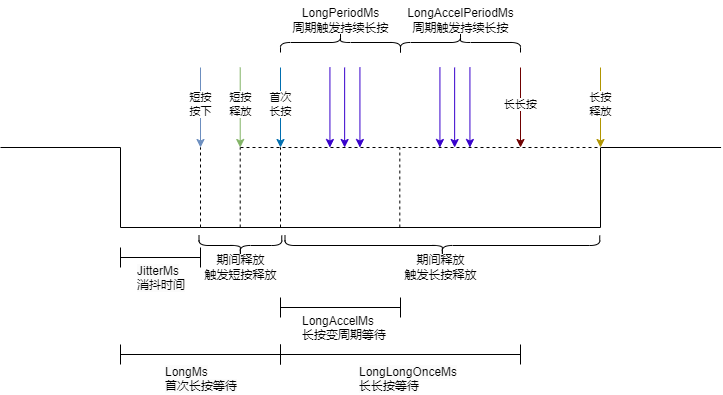

# module-key_scan
    主仓：https://gitee.com/oldking-ecu
    镜像：https://github.com/oldking-ecu

#### 介绍

按键扫描，支持短按按下(单次)、短按释放(单次)、首次长按时间大于t1(单次)、持续长按(p1周期)、持续长按大于t2(p2周期)、长长按(单次)、长按释放(单次)。   比较典型的应用用于调整参数值，长按快速改变、按的越久，数值变化越快，以上按键事件可以灵活组合。

#### 软件架构

详情见B站网址:

#### 使用说明

#### 1.配置
配置每个按键的时序参数共计6个参数，个参数含义见下图，每种颜色代表一种事件；提供一个按键按下状态查询；提供一个tick函数；提供一个按键触发回调函数，在函数内部处理逻辑；，具体可以参考user_demo中代码。
#### 2.使用
先调用初始化；再周期调用main；在按键回调MsgCbk_FuncPtr中处理按键事件即可，具体可以参考user_demo中代码。

#### 参与贡献

1.  Fork 本仓库
2.  新建 Feat_xxx 分支
3.  提交代码
4.  新建 Pull Request

#### 支持本项目

若这个项目帮到了你，不妨点个星标~，愿意的话也可以小额捐赠，感谢每一份认可~~

#### 捐赠者致谢

感谢以下朋友支持(按捐赠时间排序)
1. XXX
